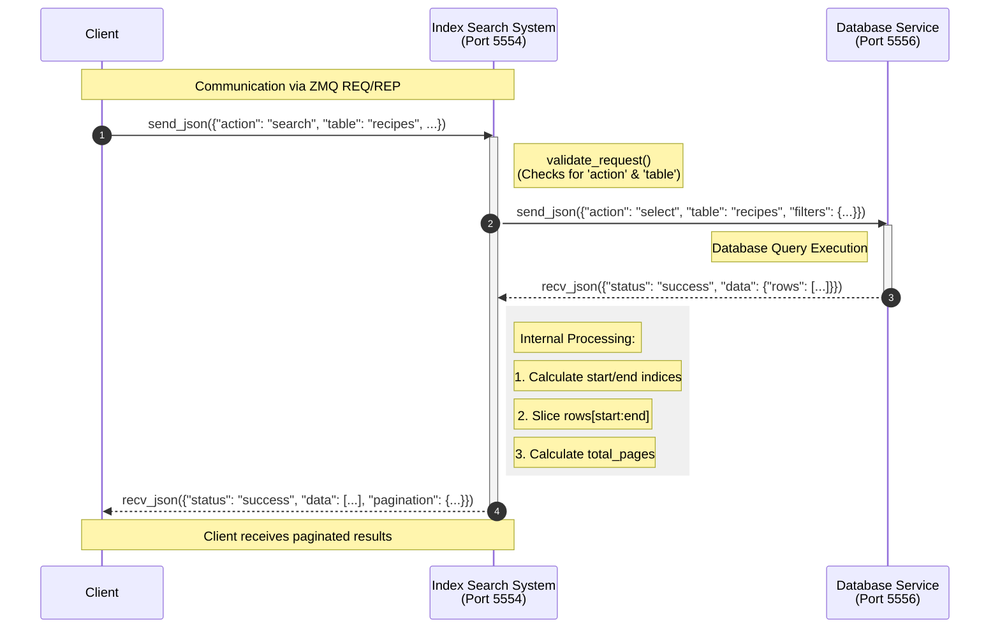

# Index Search System Microservice
## Description

The Index Seach System is a microservice designed to search through high volumes of stored data efficiently. It acts as a middle layer to connect
to a database control layer via ZeroMQ. This search service first validates search parameters, queries the database for results, then returns those results to the client. This allows the client to utilize the automated pagination and centralized search logic without having to be familiar with the underlying database structure. 

## Service configuration

The microservice can be configured via constants declared at the top of the searchMicroservice.py file. These values define the local listening port and the address of the upstream database service.
```Python3
SEARCH_PORT = 5554
DB_SERVICE_ADDRESS = "tcp://localhost:5556"
MAX_PAGE_SIZE = 100
DEFAULT_PAGE_SIZE = 10
```
## How to Make Requests

To make a request, the client uses ZeroMQ as a communication pipe by following these steps:
1. Create a ZeroMQ context and request socket.
2. Connect the request socket to the Search Service (default port 5554).
3. Send a request in the correct JSON format using send_json() or send() with encoded JSON.
4. Listen for a response using recv_json() or recv().
5. Close the socket when finished.

### request json format
Requests must be sent in a JSON format specifying the action and the target table as follows:
```JSON
{
  "action": "search",
  "table": "TABLE_NAME_AS_STRING",
  "filters": {
    "COLUMN_NAME": "VALUE"
  },
  "page": INTEGER_VALUE,
  "page_size": INTEGER_VALUE
}
```
### creating and using a request socket

Here is an example of establishing a connection and requesting data using Python:
```
import zmq
import json

# 1. Create a ZeroMQ context and request socket
context = zmq.Context()
socket = context.socket(zmq.REQ)

# 2. Connect to the service
socket.connect("tcp://localhost:5554")

# 3. Send a request
request = {
    "action": "search",
    "table": "recipes",
    "filters": {"rating": 5},
    "page": 1,
    "page_size": 10
}
socket.send_json(request)

# 4. Listen for a response
response = socket.recv_json()

socket.close()
```

### How to recieve a response

Responses are returned as JSON objects containing a status indicator, the requested data (rows), and pagination metadata to help the client navigate large result sets.

### Response JSON Format
```JSON
{
  "status": "success",
  "data": [
    {"id": 1, "name": "Example Row", "...": "..."},
    {"id": 2, "name": "Another Row", "...": "..."}
  ],
  "pagination": {
    "page": 1,
    "page_size": 10,
    "total_records": 45,
    "total_pages": 5
  }
}
```

#### Success Responses
A success response indicates that the database was successfully queried. Even if no rows match the filters, the status will be "success" and the data list will be empty []. An example of this is shown above.

#### Fail Responses
If the request is missing required fields (like action or table) or if the upstream Database Service is unavailable, the service returns an error status:
```JSON
{
  "status": "error",
  "message": "Detailed error message here"
}
```

### Request/Response Examples
This is what a search request/response would look like in my application for my recipe browser website:
```JSON
# Requesting the first 10 recipes
request = {
    "action": "search",
    "table": "recipes"
}
socket.send_json(request)
response = socket.recv_json()
# Result: status="success", data=[...first 10 recipes...]
```
This would be a filtered search for a movie database with customized pagination:
```JSON
# Requesting page 2 of movies with a 5-star rating
request = {
    "action": "search",
    "table": "movies",
    "filters": {"rating": 5},
    "page": 2,
    "page_size": 5
}
socket.send_json(request)
response = socket.recv_json()
```
## UML Sequence Diagram

